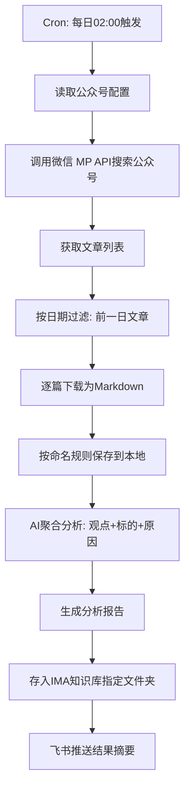

# wechat-article-surfer — 公众号文章自动抓取分析 Skill

基于 wechat-article-exporter 源码提取核心逻辑后的轻量本地实现（wechat-mp-client），实现微信公众号文章定时抓取、AI 分析和 IMA 知识库存储。

---

## 工作流程总览



---

## 架构概览

```
┌──────────────────────────────────────────────────────────────┐
│              wechat-article-surfer                           │
│  {managed_skill_dir}/wechat-article-surfer/                   │
│                                                              │
│  src/login-server.js ── 一次性扫码登录服务器                  │
│  src/cli.js          ── CLI 命令行工具                      │
│  src/proxy.js        ── 微信 MP 后端 API 代理核心            │
│  src/cookie-store.js ── 本地文件 Cookie 存储                │
│  .data/              ── Cookie 持久化 + 文章存储            │
└──────────────────────────────────────────────────────────────┘

登录流程：用户扫码 → WeChat session cookie 存储本地 → cookies 有效期 4 天

## 配置要求

### 前置依赖

| 依赖 | 说明 |
|------|------|
| **Node.js** | 22+，依赖仅 turndown + cheerio（约 17 个包）|
| **IMA OpenAPI 凭证** | IMA 笔记的 client_id + api_key，存于 `~/.config/ima/` |
| **飞书 Token** | 用户 access_token，用于读取公众号列表和写入 Wiki |

### 首次登录

```bash
cd {managed_skill_dir}/wechat-article-surfer
node src/cli.js login
# 或：npm run login
# 浏览器打开 http://localhost:3000
# 扫码登录 → 自动保存 cookies 到 .data/wechat-cookies.json
```

> ⚠️ **登录会话有效期约 4 天**，到期后需重新登录。建议每 3 天重新扫码一次。

### 配置文件

所有配置写在 `config.json` 中（不提交 git，已加入 .gitignore）：

```json
{
  "feishu": {
    "sheet_token": "飞书表格token",
    "sheet_id": "工作表ID",
    "token_file": "~/.qclaw/skills-config/feishu/tokens/user_token.json",
    "space_id": "Wiki空间ID",
    "default_parent_node": "Wiki父节点token"
  },
  "wechat": {
    "cookies_path": ".data/wechat-cookies.json"
  },
  "ima": {
    "credential_dir": "~/.config/ima",
    "knowledge_base_id": "知识库ID"
  },
  "article_storage": ".data/articles"
}
```

---

## 核心功能

### 1. 公众号搜索与文章拉取

通过 CLI 操作：

**Step 1: 检查登录状态**
```bash
node src/cli.js status
```

**Step 2: 搜索公众号 → 获取 fakeid**
```bash
node src/cli.js search 投资明见
```
输出 fakeid。

**Step 3: 获取文章列表**
```bash
node src/cli.js articles <fakeid>
```
返回文章列表，含 `title`、`create_time`、`link` 等字段。

**Step 4: 批量下载文章**
```bash
node src/cli.js dump <fakeid> 20
```
自动下载为 Markdown 文件，保存到 `.data/articles/` 目录。

**或单篇下载：**
```bash
node src/cli.js download https://mp.weixin.qq.com/s/xxx
```

### 2. 文件命名规则

```
{公众号名}-{YYYY-MM-DD}-{标题}.md
```

规则：
- **公众号名**：公众号名称（去除非法字符）
- **YYYY-MM-DD**：文章发布时间
- **标题**：原文章标题（去除非法字符，限制 100 字符）
- 非法字符（`\ / : * ? " < > |`）替换为空格后合并
- 存放目录：`.data/articles/`（集中存储，不按公众号分目录）

### 3. AI 分析

每批次文章需产出两份内容：

**A) 每篇文章的 Markdown 文件** — 原始下载内容

**B) 聚合分析报告** — 提取以下信息：

```markdown
# 公众号「投资明见」日报 YYYY-MM-DD

## 📊 概览
- 日期：YYYY-MM-DD
- 文章数：N 篇
- 抓取时间：YYYY-MM-DD 02:00

---

## 1. 《文章标题一》
### 📌 核心观点
[AI 提取的主要观点]

### 🎯 标的与方向
| 标的 | 方向 | 原因 |
|------|------|------|
| 标的名称 | 看好/看空 | AI 分析的原因 |

### 💡 关键论据
- 论据1
- 论据2

---

## 2. 《文章标题二》
...
```

**分析维度：**
- **核心观点**：每篇文章的核心论点、判断
- **标的识别**：提及的股票、基金、行业、板块等投资标的
- **方向判断**：看多/看空/中性，以及置信度
- **关键论据**：支撑该判断的数据、逻辑、引用
- **潜在风险**：文章中提及的风险因素

### 4. IMA 知识库存储

通过 IMA OpenAPI 将文件存入指定文件夹：

**方式一：上传 Markdown 文件到知识库**

利用 IMA knowledge-base 模块的上传文件能力：

```bash
# 1. 创建媒体凭证
curl -s -X POST "https://ima.qq.com/openapi/wiki/v1/create_media" \
  -H "ima-openapi-clientid: $IMA_CLIENT_ID" \
  -H "ima-openapi-apikey: $IMA_API_KEY" \
  -H "Content-Type: application/json" \
  -d '{
    "file_name": "YYYY-MM-DD-作者-标题.md",
    "file_size": <文件大小>,
    "content_type": "text/markdown",
    "knowledge_base_id": "<kb_id>",
    "file_ext": "md"
  }'

# 2. COS 上传
# 3. add_knowledge 关联到知识库
```

**方式二：创建 IMA 笔记**

利用 notes 模块：

```bash
curl -s -X POST "https://ima.qq.com/openapi/note/v1/import_doc" \
  -H "ima-openapi-clientid: $IMA_CLIENT_ID" \
  -H "ima-openapi-apikey: $IMA_API_KEY" \
  -H "Content-Type: application/json" \
  -d '{
    "content_format": 1,
    "content": "# 标题\n\n正文内容",
    "folder_id": "<文件夹ID>"
  }'
```

**方式三：将笔记关联到知识库**

```bash
curl -s -X POST "https://ima.qq.com/openapi/wiki/v1/add_knowledge" \
  -H "ima-openapi-clientid: $IMA_CLIENT_ID" \
  -H "ima-openapi-apikey: $IMA_API_KEY" \
  -H "Content-Type: application/json" \
  -d '{
    "media_type": 11,
    "note_info": { "content_id": "<doc_id>" },
    "title": "YYYY-MM-DD-作者-标题",
    "knowledge_base_id": "<kb_id>"
  }'
```

### 5. 推送与通知

分析完成后：
1. 汇总抓取结果（文章数、分析摘要）
2. 通过飞书/当前渠道推送给用户
3. 附上 IMA 知识库链接（如可获取）

---

## 定时任务配置

### 每日 Cron（02:00 AM）

```bash
# 方式 A - 内置 cron 工具
cron(schedule: {"kind":"cron","cron":"0 2 * * *"}, prompt: "...")
```

### 一次性测试（立即执行）

```bash
openclaw cron add --message "立即执行公众号文章抓取分析" --no-cron
```

### 手动触发

用户发送"抓取公众号文章"时，按 SKILL.md 流程执行一次。

---

## 执行流程（Agent 执行路径）

当 cron（每日 02:00）触发时，直接运行 `daily-workflow.js --backlog`：

```bash
cd {managed_skill_dir}/wechat-article-surfer
node scripts/daily-workflow.js --backlog
```

`--backlog` 模式自动检测所有未完成的日期并逐个执行，每个日期独立完成完整 Phase。

### 手动触发

```bash
# 指定日期
node scripts/daily-workflow.js --date 2026-06-15

# 手动检查 session
node scripts/check_session.js
```

---

## 错误处理

| 场景 | 处理 |
|------|------|
| 登录会话过期 | 通知用户重新扫码登录 (`node src/cli.js login`) |
| 公众号搜索不到 | 检查名称是否准确 |
| 当日无文章 | 记录"无新文章"，跳过 |
| IMA 上传失败 | 本地文件保留，下次重试 |
| 某篇文章下载失败 | 跳过该篇，记录错误，继续处理其他篇 |

---

## 数据目录结构

```
{skill_dir}/
├── SKILL.md
├── README.md
├── config.json              # 真实配置（不提交 git）
├── config.example.json      # 配置模板
├── package.json             # 依赖
├── .gitignore
├── src/                     # 核心源码
│   ├── proxy.js             # 微信API代理
│   ├── login-server.js      # 扫码登录服务器
│   ├── cookie-store.js      # Cookie持久化
│   └── cli.js               # 命令行工具
├── scripts/                 # 业务脚本
│   ├── daily-workflow.js    # 每日工作流（全自动，唯一入口）
│   ├── ima-upload.cjs       # IMA上传助手
│   ├── check_session.js     # 微信 session 检查
│   ├── generate-summary-prompt.js  # AI分析提示词生成器
│   ├── fix-fakeids.js       # FakeId修复
│   └── search_batch.js      # 批量搜索
├── bin/                     # 可执行脚本
│   └── start-login.sh       # 一键启动登录
└── .data/                   # 运行时数据（不提交 git）
    ├── wechat-cookies.json  # 微信登录cookies
    └── articles/            # 已下载的Markdown文章
```

---

## 飞书表格结构

公众号订阅列表存储在飞书表格中，结构如下：

| 列 | 字段 | 说明 |
|----|------|------|
| A | 公众号名称 | 显示名称 |
| B | 微信号 | 原始微信号 |
| C | FakeId | 微信内部ID（用于API调用）|
| D | 状态 | 启用/手动/禁用 |
| E | 最后拉取结果 | 时间\|结果\|详情（见下方枚举）|

### 拉取结果枚举（FETCH_RESULT）

所有可能的结果类型，固化在代码中：

| 结果 | 说明 | 是否需要补跑 |
|------|------|-------------|
| 成功 | 成功拉取文章 | 否 |
| 无文章 | 该日期无文章（真没有） | 否 |
| 频控限制 | ret=200013，微信频率限制 | **是** |
| 参数无效 | ret=200002，fakeid错误等 | 否（需人工修复） |
| API错误 | 其他API错误 | **是** |
| 下载失败 | 文章下载失败 | **是** |
| 已禁用 | 账号状态为禁用 | 否 |
| 手动模式 | 账号状态为手动 | 否 |
| 待处理 | 从未拉取过 | **是** |

### 补跑逻辑

```javascript
// 需要补跑的结果类型
const NEED_RETRY = ['频控限制', 'API错误', '下载失败'];

// 判断是否需要补跑
function needRetry(account, targetDate) {
  if (account.status !== '启用') return false;
  if (!account.lastResult || account.lastResult === '待处理') return true;

  const parts = account.lastResult.split('|');
  const ts = parts[0];          // 时间戳
  const result = parts[1] || parts[0];

  // 日期感知：检查 E 列结果的日期是否等于目标日期
  if (targetDate) {
    const tsDate = parseTimestampDate(ts);
    if (tsDate && tsDate !== targetDate) return true;  // 日期不匹配 → 当天未处理
  }

  return NEED_RETRY.includes(result);
}

// 辅助：从 E 列时间戳解析日期
function parseTimestampDate(ts) {
  if (!ts || typeof ts !== 'string') return null;
  const m = ts.match(/(\\d{4})\\/(\\d{1,2})\\/(\\d{1,2})/);
  if (!m) return null;
  return `${m[1]}-${m[2].padStart(2,'0')}-${m[3].padStart(2,'0')}`;
}
```

补跑策略：
- 检查 E 列结果日期，不等于目标日期视为当天未处理
- **只补** 频控限制/API错误/下载失败/待处理（且当天未处理）
- **不补** 无文章/已禁用/手动模式/参数无效（当天已处理）

### 结果格式

E列格式：`YYYY-MM-DD HH:MM:SS|结果|详情`

示例：
- `2026-06-10 15:30:00|成功|3篇`
- `2026-06-10 15:31:00|无文章|2026-06-09无文章`
- `2026-06-10 15:32:00|频控限制|ret=200013`
- `2026-06-10 15:33:00|参数无效|ret=200002`

---


## 配置说明

### config.json 关键字段

```json
{
  "feishu": { ... },          // 飞书表格/知识库配置
  "wechat": { ... },          // 微信 cookies 路径
  "ima": { ... },             // IMA 知识库配置
  "article_storage": ".data/articles",
  "kimi": {
    "api_key": "sk-kimi-..."  // Kimi API Key（解决 cron 子进程不加载 ~/.zshrc 的问题）
  }
}
```

**注意**：KIMI_API_KEY 除了在 `~/.zshrc` 中，也写入了 `config.json` 的 `kimi.api_key` 字段。
`callLlm()` 会优先从 `process.env.KIMI_API_KEY` 读取，fallback 到 `config.json`。
